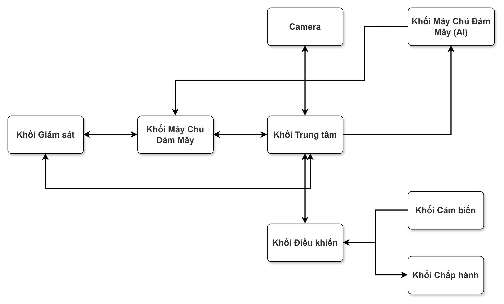

# Hệ Thống IoT Giám Sát Và Điều Khiển Nông Nghiệp

README này tóm tắt chức năng các khối trong hệ thống để dễ viết báo cáo và làm slide.

## Sơ đồ khối hệ thống

## 1. Mục tiêu hệ thống

Hệ thống dùng để giám sát môi trường trồng cây, điều khiển tưới nước và phát hiện bệnh cây bằng hình ảnh AI. Người dùng theo dõi dữ liệu và gửi lệnh từ điện thoại. Các thiết bị tại vườn thu thập dữ liệu, điều khiển bơm và gửi thông tin lên Firebase.

## 2. Linh kiện chính

| Khối | Linh kiện / nền tảng | Vai trò |
| --- | --- | --- |
| Khối Giám sát | Điện thoại / ứng dụng mobile | Hiển thị dữ liệu, gửi lệnh điều khiển, cấu hình WiFi |
| Khối Máy Chủ Đám Mây | Firebase / Cloud Database | Lưu dữ liệu cảm biến, lệnh điều khiển, kết quả AI |
| Khối Trung tâm | Raspberry Pi | Điều phối hệ thống, nhận lệnh, gửi dữ liệu, giao tiếp BLE |
| Camera | Camera kết nối Raspberry Pi | Chụp ảnh cây trồng |
| Khối Máy Chủ Đám Mây (AI) | Server AI / Hugging Face | Phân tích ảnh, nhận diện bệnh cây |
| Khối Điều khiển | ESP32 | Đọc cảm biến, nhận lệnh bơm, điều khiển relay |
| Khối Cảm biến | Cảm biến nhiệt độ, độ ẩm, độ ẩm đất, ánh sáng | Đo thông số môi trường |
| Khối Chấp hành | Relay, máy bơm nước | Thực hiện tưới nước |

## 3. Chức năng các khối

### Khối Giám sát

Khối Giám sát chính là mobile app trên điện thoại của người dùng. App dùng để xem nhiệt độ, độ ẩm, độ ẩm đất, ánh sáng, trạng thái bơm và kết quả nhận diện bệnh cây. Người dùng cũng có thể bật/tắt bơm hoặc yêu cầu chụp ảnh mới.

### Khối Máy Chủ Đám Mây

Là nơi lưu trữ và trung chuyển dữ liệu. Trong hệ thống này, khối này dùng Firebase để nhận dữ liệu từ thiết bị tại vườn, lưu lịch sử đo, lưu trạng thái bơm và kết quả phân tích AI. Ứng dụng mobile lấy dữ liệu từ đây để hiển thị.

### Khối Trung tâm

Là bộ điều phối chính của hệ thống. Raspberry Pi nhận lệnh từ Khối Máy Chủ Đám Mây, giao tiếp với Camera, gửi ảnh lên Khối Máy Chủ Đám Mây (AI), nhận dữ liệu từ ESP32 qua BLE và đẩy dữ liệu lên Firebase.

### Camera

Camera chụp ảnh cây trồng khi có lệnh từ Khối Trung tâm. Ảnh sau đó được gửi đến Khối Máy Chủ Đám Mây (AI) để phân tích tình trạng bệnh.

### Khối Máy Chủ Đám Mây (AI)

Khối Máy Chủ Đám Mây (AI) nhận ảnh cây trồng, chạy mô hình nhận diện bệnh và trả kết quả về hệ thống. Kết quả này được lưu lên Firebase để người dùng xem trên ứng dụng.

### Khối Điều khiển

ESP32 đọc dữ liệu từ cảm biến và gửi về Raspberry Pi qua BLE. Khi nhận lệnh điều khiển bơm từ Raspberry Pi, ESP32 xuất tín hiệu điều khiển relay để bật hoặc tắt máy bơm.

### Khối Cảm biến

Các cảm biến đo thông số môi trường tại khu vực trồng cây. Dữ liệu đo được gửi về ESP32 để xử lý và truyền tiếp lên hệ thống.

### Khối Chấp hành

Gồm relay và máy bơm nước. Relay nhận tín hiệu từ ESP32 để đóng hoặc ngắt nguồn cho máy bơm.

## 4. Giao thức truyền thông

### HTTP

HTTP được dùng cho các kết nối qua Internet giữa Khối Giám sát, Khối Máy Chủ Đám Mây, Khối Trung tâm và Khối Máy Chủ Đám Mây (AI).

Các luồng chính:

- Ứng dụng mobile gửi lệnh và lấy dữ liệu từ Firebase.
- Raspberry Pi gửi dữ liệu cảm biến, ảnh hoặc trạng thái thiết bị lên Firebase.
- Raspberry Pi gửi ảnh cây trồng lên Khối Máy Chủ Đám Mây (AI) để phân tích.
- Khối Máy Chủ Đám Mây (AI) trả kết quả nhận diện bệnh về hệ thống.

### BLE

BLE được dùng cho kết nối không dây tầm gần, tiết kiệm năng lượng.

Các luồng chính:

- ESP32 gửi dữ liệu cảm biến về Raspberry Pi.
- Raspberry Pi gửi lệnh bật/tắt bơm xuống ESP32.
- Ứng dụng mobile có thể kết nối trực tiếp Raspberry Pi qua BLE để cấu hình WiFi ban đầu.

## 5. Luồng hoạt động chính

### Luồng giám sát cảm biến

`Cảm biến -> ESP32 -> BLE -> Raspberry Pi -> HTTP -> Firebase -> Ứng dụng mobile`

Dữ liệu môi trường được đo tại vườn, gửi qua ESP32 và Raspberry Pi, sau đó lưu lên Firebase để người dùng theo dõi.

### Luồng điều khiển bơm

`Ứng dụng mobile -> HTTP -> Firebase -> HTTP -> Raspberry Pi -> BLE -> ESP32 -> Relay -> Máy bơm`

Người dùng gửi lệnh bật/tắt bơm. Lệnh đi qua Firebase và Raspberry Pi, sau đó ESP32 điều khiển relay để chạy hoặc dừng bơm.

### Luồng chụp ảnh và nhận diện bệnh

`Ứng dụng mobile -> Firebase -> Raspberry Pi -> Camera -> Khối Máy Chủ Đám Mây (AI) -> Firebase -> Ứng dụng mobile`

Người dùng yêu cầu chụp ảnh. Camera chụp ảnh cây, Khối Máy Chủ Đám Mây (AI) phân tích bệnh và kết quả được hiển thị lại trên ứng dụng.

### Luồng app gửi ảnh trực tiếp lên AI

`Ứng dụng mobile -> HTTP -> Khối Máy Chủ Đám Mây (AI) -> HTTP -> Firebase -> HTTP -> Ứng dụng mobile`

Người dùng có thể chụp hoặc chọn ảnh trên app rồi gửi trực tiếp lên Khối Máy Chủ Đám Mây (AI) để phân tích. Sau khi AI xử lý xong, kết quả được lưu lên Firebase và app lấy kết quả từ Firebase để hiển thị cho người dùng.

### Luồng cấu hình WiFi ban đầu

`Ứng dụng mobile -> BLE -> Raspberry Pi`

Ứng dụng gửi tên WiFi và mật khẩu cho Raspberry Pi qua BLE để thiết bị có thể kết nối Internet.
